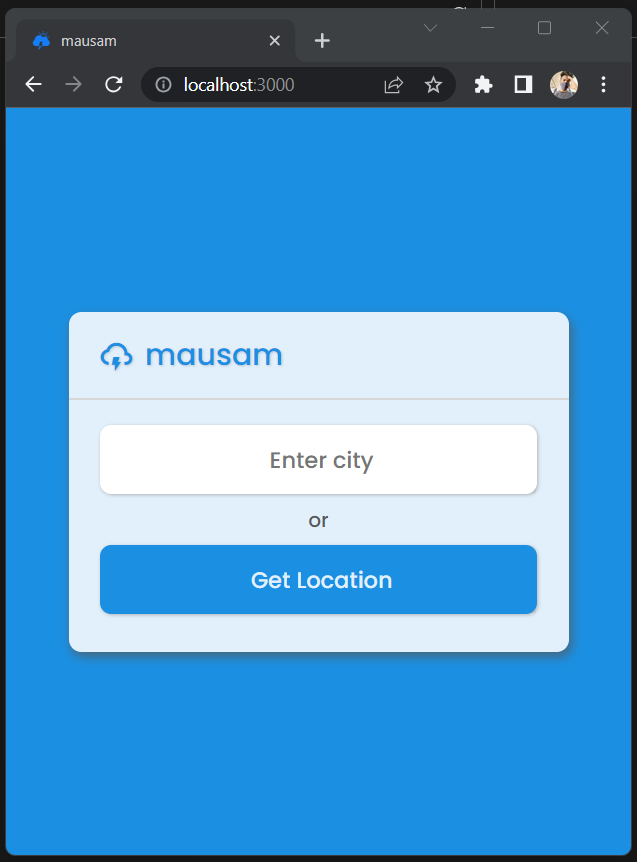
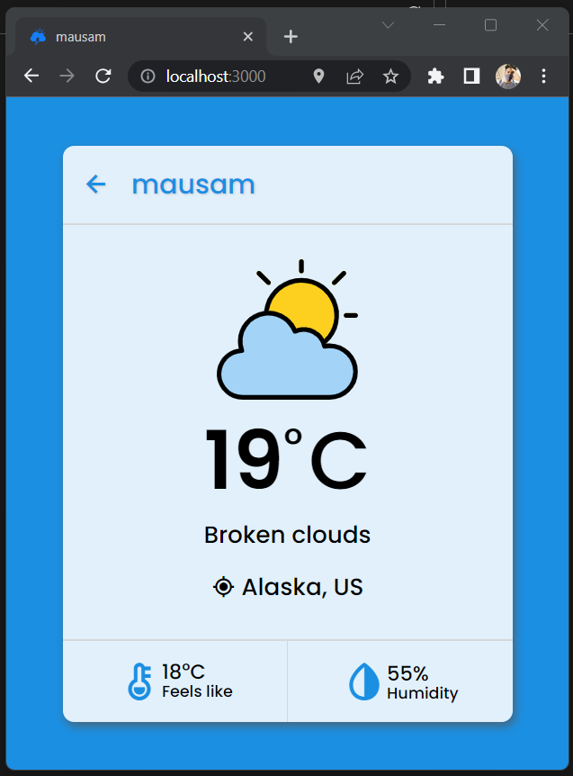
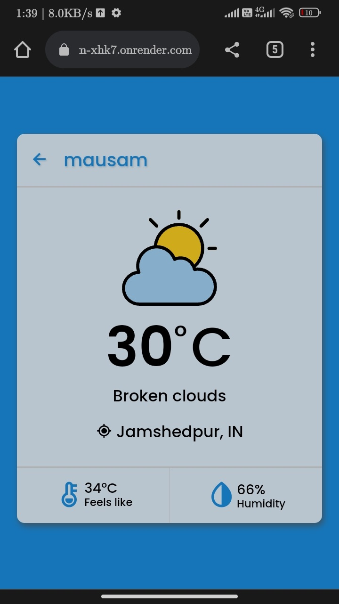

# [mausam](https://mausam-xhk7.onrender.com/) - Dynamic Wheather App

## Technologies used
- HTML
- JavaScript
- SCSS for CSS
- NodeJS
- ExpressJS

## Resouces
- [Font Awesome](https://fontawesome.com/) for icons
- [Favicon Generator](https://realfavicongenerator.net/) for generating Favicon
- [Render](https://render.com/) for deploying the app.

## API used :

## Screenshots

Desktop Views   
  
 
Mobile Phone View   
  
